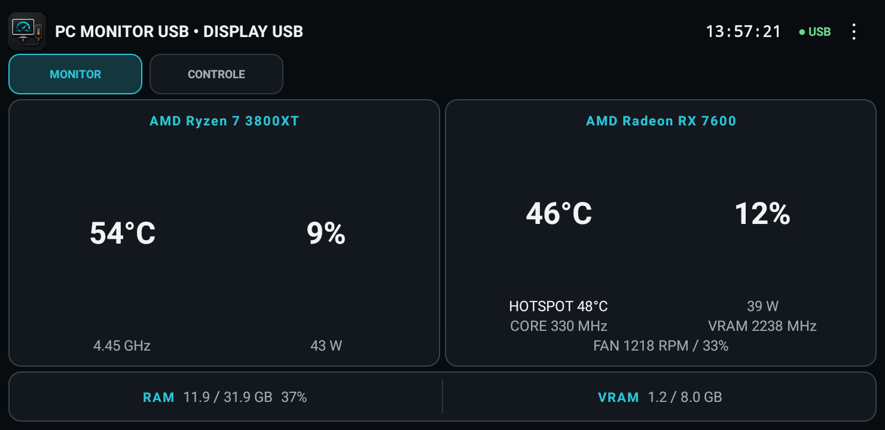
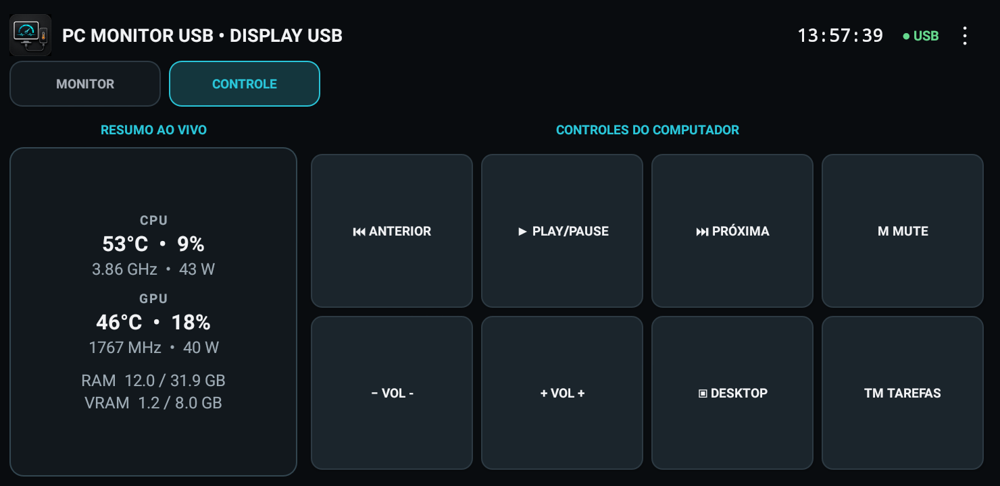
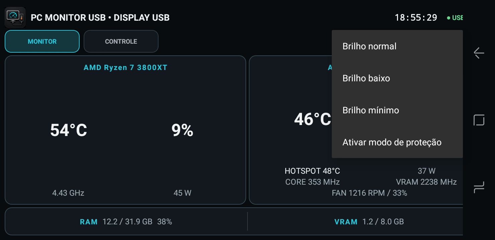
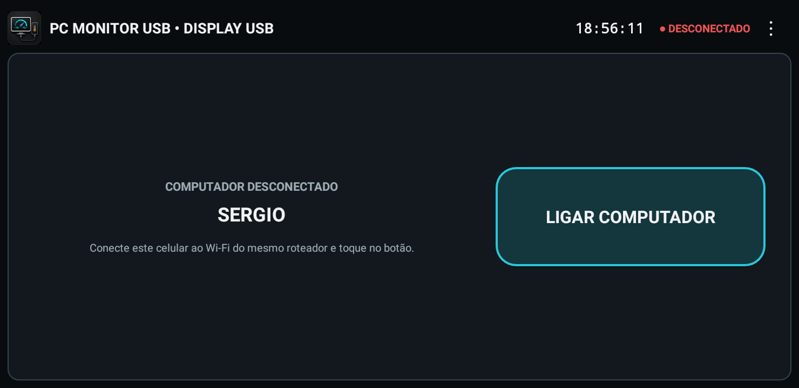

# Android interface gallery

These screenshots were captured from the release APK running on a real Samsung Galaxy J4 Core (SM-J410G). Sensor values are live examples and naturally vary by computer and workload.

All gallery images use the landscape layout.

## Monitor mode

Monitor mode prioritizes the live CPU, GPU, RAM, and VRAM readings, including temperatures, usage, clocks, power, hotspot, and fan data when the connected hardware exposes them.

## Control mode

Control mode keeps a compact live hardware summary and gives the available space to large, aligned PC-control buttons. The visible buttons follow the allowlist configured in the Windows application.

## Display options and disconnected PC

| Brightness and protection | Wake-on-LAN |
| --- | --- |
|  |  |

The display menu changes only the current Activity brightness and toggles the subtle screen-protection offset. When USB communication is unavailable and Wake-on-LAN is configured, the dedicated power screen replaces stale monitor values.

---

# Galeria da interface Android

Estas imagens foram capturadas na orientação horizontal do APK de lançamento executando em um Samsung Galaxy J4 Core (SM-J410G) real. Os valores dos sensores são exemplos ao vivo e variam naturalmente conforme o computador e a carga de trabalho.

- **Monitor:** prioriza os sensores detalhados de CPU, GPU, RAM e VRAM.
- **Controle:** mantém um resumo ao vivo e exibe botões grandes e alinhados, conforme a lista permitida configurada no Windows.
- **Opções de tela:** permite escolher o brilho da Activity e ativar o deslocamento discreto de proteção.
- **Ligar computador:** substitui os valores antigos quando o USB está desconectado e o Wake-on-LAN foi configurado.
